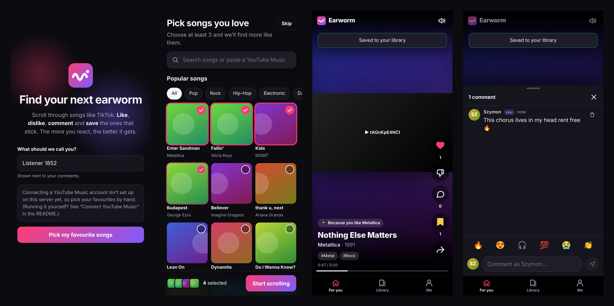
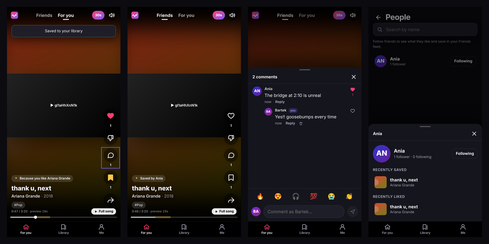

# Earworm 🎧

**A TikTok-style music discovery app.** Pick a few songs you love (or import them from YouTube Music), then swipe through a full-screen feed of songs chosen for you. **Like**, **dislike**, **comment** and **save** as you go. Every reaction tunes what comes next, and it can all sync back to your YouTube Music account. Follow your friends to see what they're saving.





<sub>Screenshots come from the end-to-end test harness, which uses placeholder artwork and a fake player because YouTube isn't reachable from CI. In a browser you get real thumbnails and music videos.</sub>

## What it does

- **Vertical song feed.** Snap-scroll through songs, one per screen. Each plays automatically through the official YouTube player. Tap to pause, double-tap to like (with a heart burst), drag the progress bar to seek.
- **Hook previews.** Each song plays a 30-second window around its hook, then moves on, so you can judge a lot of songs quickly. Tap **Full song** to keep listening, or switch previews off with the **30s** pill. Earworm learns where the hook is: when listeners jump to a spot and keep listening for 15 seconds, that counts as a vote, and once two or more people have voted, the median becomes the song's hook for everyone. Until then it estimates the hook from the song's length.
- **React to songs.**
  - ❤️ **Like** a song to get more like it.
  - 👎 **Dislike** a song to hide it and skip to the next one.
  - 💬 **Comment** in a thread shared by all listeners, with quick emoji reactions. Like comments and reply to them.
  - 🔖 **Save** a song to your library.
  - ↗️ **Share** a link that opens straight into that song, even for first-time visitors.
- **Friends.** Find people on the **People** page and follow them. The **Friends** tab is a feed of songs the people you follow have liked and saved ("Saved by Ania and 2 others"). Their picks also get a boost in your For you feed. Tap a name or avatar to see someone's recent saves and likes. You can hide your own activity on the **Me** tab.
- **Pick favourites to start.** Choose from popular songs by genre, search, or paste any YouTube / YouTube Music link (song or playlist).
- **Connect YouTube Music** (optional):
  - Import your liked songs and playlists to choose favourites from.
  - Likes and dislikes become YouTube ratings, which YouTube Music shares.
  - Saved songs go into a private **“Earworm saves”** playlist.
  - Sign in again from another device and you get the same profile back.
- **"For you" recommendations** that explain themselves ("Because you like Arctic Monkeys", "Similar to Tame Impala", "Loved by people you follow"). They reach beyond the artists you already know by looking up similar artists. See [How recommendations work](#how-recommendations-work).
- **Library** with Saved, Liked, Favourites and Disliked lists (undo a dislike from here). **Profile** with your stats, followers, sync toggles, playback and privacy settings.
- Works out of the box with a built-in catalogue of 433 well-known songs across 27 genres. Desktop gets keyboard shortcuts: <kbd>↑</kbd>/<kbd>↓</kbd>, <kbd>Space</kbd>, <kbd>L</kbd>, <kbd>D</kbd>, <kbd>S</kbd>, <kbd>C</kbd>, <kbd>M</kbd>.

## Quick start

You need **Node.js 22.13 or newer** (the app uses Node's built-in SQLite).

```bash
npm install
npm run dev
```

Open <http://localhost:3000>. That's it: with no configuration, Earworm runs in **demo mode** with the built-in catalogue. Your likes, saves and comments are stored in `data/earworm.db`.

To connect real YouTube Music accounts, add credentials as described below.

## Connect YouTube Music

YouTube Music has no separate public API. It shares likes, ratings and playlists with YouTube, so Earworm uses the official **YouTube Data API v3** with Google sign-in.

1. In the [Google Cloud Console](https://console.cloud.google.com/), create a project (or pick an existing one).
2. Under **APIs & Services → Library**, enable **YouTube Data API v3**.
3. Under **APIs & Services → OAuth consent screen**, set up an **External** app. Add these scopes: `openid`, `.../auth/userinfo.email`, `.../auth/userinfo.profile` and `https://www.googleapis.com/auth/youtube`. While the app is in *Testing*, add your Google account (and your friends') as **test users**.
4. Under **APIs & Services → Credentials**:
   - Create an **OAuth client ID** of type **Web application**.
   - Add the authorized redirect URI `http://localhost:3000/api/auth/google/callback`, plus `https://your-domain/api/auth/google/callback` for production.
5. Optional but recommended: create an **API key** in the same place and restrict it to *YouTube Data API v3*. With a key, everyone can search YouTube and paste playlist links, even without connecting an account.
6. Copy `.env.example` to `.env` and fill in the values:

   ```bash
   GOOGLE_CLIENT_ID=1234-abc.apps.googleusercontent.com
   GOOGLE_CLIENT_SECRET=GOCSPX-...
   YOUTUBE_API_KEY=AIza...        # optional
   APP_URL=http://localhost:3000
   ```

7. Restart `npm run dev`. The welcome screen now shows a **Connect YouTube Music** button.

> **Going public?** `…/auth/youtube` is a *sensitive* scope. An unverified app is limited to 100 test users, and Google must verify the app before anyone else can sign in. Review the [YouTube API Services Terms and Developer Policies](https://developers.google.com/youtube/terms/developer-policies) too. See [Notes and limitations](#notes-and-limitations).
>
> **Testing mode expires connections after 7 days.** Earworm keeps the listener's profile and shows a **Reconnect** banner, and reconnecting picks up where they left off. [docs/DEPLOY.md](docs/DEPLOY.md#3-set-up-google-connect-youtube-music) explains how to avoid it.

### What gets synced

| In Earworm                   | On YouTube Music                                                      |
| ---------------------------- | --------------------------------------------------------------------- |
| Like / dislike / clear       | The video is rated like / dislike / none (`videos.rate`)              |
| Save / unsave                | Added to / removed from your private **Earworm saves** playlist        |
| Connecting your account      | Your liked music and playlists appear in the favourites picker        |
| Comments                     | Stay inside Earworm. Nothing is posted to YouTube.                     |

Both kinds of sync can be switched off on the **Me** tab.

### API quota

The YouTube Data API gives each Google Cloud project **10,000 units per day** by default. Earworm caches what it can and throttles discovery to about once every 6 hours per listener.

| Action                                       | Cost        |
| -------------------------------------------- | ----------- |
| Import likes / playlists, load a playlist     | 1 unit per page of 50 |
| Trending chart, artist uploads (discovery)   | 1–2 units   |
| Like, dislike, save, unsave (sync)            | 50 units    |
| YouTube search (picker, discovery)            | 100 units   |

Discovery searches (songs by similar artists, genre search) share a daily cap, `YOUTUBE_DAILY_SEARCH_BUDGET` (default 30 searches, at most 3,000 units). Each artist's results are cached for two weeks.

## How recommendations work

All of the ranking lives in [`server/recommender.ts`](server/recommender.ts) as small pure functions with tests.

1. **Taste profile.** Every signal adds weight to that song's artists, genres and moods:
   - Favourites +3, likes +2, saves +1.5, imported YouTube likes and playlists +1.
   - Listening for 45 seconds or more counts +0.5. Skipping within 5 seconds counts −0.5.
   - Dislikes count −3.
2. **Similar artists.** For your top artists, Earworm looks up similar artists from [Last.fm](https://www.last.fm/api) (with a free API key) or Deezer's public API (no key needed). Results are cached for 30 days. Affinity spreads from artists you like to their neighbours, unless you've disliked those.
3. **Scoring.** Each candidate song is scored on:
   - Artist match (featured artists count too), plus genre and mood overlap.
   - Similarity to artists you like, for artists you haven't heard on Earworm yet.
   - What the people you follow liked and saved, and what listeners with overlapping taste liked (collaborative filtering).
   - Popularity, and whether it's trending on YouTube.
   - A penalty if you saw it recently.
4. **Variety.** No artist twice in a row and at most two per batch. Every fifth song is an exploration pick from outside your usual taste, so the feed doesn't become an echo chamber.
5. **More songs.** If a YouTube API key or a connected account is available, the server pulls in fresh candidates (throttled, see above):
   - Your region's trending music chart.
   - Recent uploads from the channels of artists you like.
   - Songs by similar artists that aren't in the catalogue yet (up to two searches per refresh, within the daily search budget).
   - Optionally, a search in your top genre (`YOUTUBE_DISCOVERY_SEARCH=true`).

The **Friends** feed is simpler: songs the people you follow liked or saved, most recent first, skipping ones you've disliked. Listeners who turned off **Show my likes & saves to followers** are left out.

## Scripts

| Command             | What it does                                                         |
| ------------------- | -------------------------------------------------------------------- |
| `npm run dev`       | API + React app with hot reload on one port (default 3000)           |
| `npm run build`     | Build the web client into `dist/`                                    |
| `npm start`         | Serve the built app in production mode                               |
| `npm test`          | Unit, API and component tests (Vitest)                               |
| `npm run test:e2e`  | Browser tests (Playwright, mobile Chromium). Run `npx playwright install chromium` once first |
| `npm run check`     | Typecheck + lint + tests                                             |

The tests never touch the network. The server tests drive the real Express app against an in-memory database and a fake Google that covers OAuth, sync, import, search and discovery. The browser tests swap YouTube's player script for a local fake ([`e2e/fixtures/fake-youtube-api.js`](e2e/fixtures/fake-youtube-api.js)).

## Configuration

All settings are environment variables and all are optional. See [`.env.example`](.env.example).

| Variable                   | Default                | Purpose |
| -------------------------- | ---------------------- | ------- |
| `PORT`                     | `3000`                 | Port to listen on |
| `APP_URL`                  | derived from request   | Public URL, used for the OAuth redirect URI. Set it in production. |
| `DATABASE_PATH`            | `./data/earworm.db`    | SQLite file (`:memory:` for throwaway runs) |
| `YOUTUBE_API_KEY`          | –                      | Enables YouTube search, playlist links and discovery for everyone |
| `GOOGLE_CLIENT_ID` / `GOOGLE_CLIENT_SECRET` | –     | Enables "Connect YouTube Music" |
| `YOUTUBE_DISCOVERY_SEARCH` | `false`                | Spend search quota on genre-based discovery |
| `YOUTUBE_DAILY_SEARCH_BUDGET` | `30`                | Max discovery searches per day across all listeners (100 units each) |
| `LASTFM_API_KEY`           | –                      | Free [Last.fm key](https://www.last.fm/api/account/create) for better similar artists |
| `SIMILAR_ARTISTS`          | `lastfm` if a key is set, else `deezer` | Similar-artist source: `lastfm`, `deezer` or `off` |
| `COOKIE_SECURE`            | `true` if `APP_URL` is https | Send the session cookie over HTTPS only |
| `TRUST_PROXY`              | –                      | Set when behind a reverse proxy (e.g. `1`) |

## Deploying

**[docs/DEPLOY.md](docs/DEPLOY.md)** walks through putting Earworm on [Fly.io](https://fly.io) for a group of friends. It's one small machine that sleeps when idle, plus a 1 GB disk, for about $2–3 a month. The repo includes a ready [`Dockerfile`](Dockerfile) and [`fly.toml`](fly.toml).

Any other host works if it gives you Node 22.13+ (or Docker) and a **persistent disk** for the SQLite file:

```bash
npm ci
npm run build
APP_URL=https://earworm.example.com COOKIE_SECURE=true npm start
# or
docker build -t earworm . && docker run -p 8080:8080 -v earworm-data:/data --env-file .env earworm
```

Serverless platforms with ephemeral filesystems won't keep your data. Put it behind HTTPS (and set `TRUST_PROXY` if a proxy terminates TLS). Remember to add the production redirect URI to your OAuth client.

## Project structure

```
server/                 Express API (TypeScript, run with tsx)
  index.ts              Entry point: config, database, Vite (dev) or static files (prod)
  app.ts                Routes are mounted under /api
  routes/               me, auth (Google OAuth), feed, songs, social (reactions/saves/comments), people (follows), library, youtube
  recommender.ts        Taste profile + ranking (pure functions)
  feed.ts               Loads signals and candidates from SQLite and builds the For you and Friends feeds
  similar.ts            Similar artists from Last.fm or Deezer, cached in SQLite
  youtube/client.ts     Google OAuth + YouTube Data API v3 client (fetch-based)
  youtube/service.ts    Token refresh, library import, sync, search, discovery
  db.ts                 node:sqlite helpers and schema migrations
  data/catalog.json     The built-in song catalogue
src/                    React 19 web app (Vite)
  components/Feed.tsx   The snap-scrolling feed
  lib/feedPlayer.ts     One shared YouTube IFrame player for the whole feed
  pages/                Welcome, pick favourites, library, people, profile
shared/                 Types and helpers used by both sides
e2e/                    Playwright tests and the fake YouTube player
docs/DEPLOY.md          Step-by-step hosting guide (Fly.io)
```

## Notes and limitations

- **Playback** uses the official YouTube IFrame Player. A transparent layer above the video handles swipes, taps and double-taps, because iframes swallow touch gestures. If you publish this, check that your use complies with YouTube's policies.
- **Autoplay.** Browsers may block sound until you interact with the page. When that happens, Earworm plays muted and shows **Tap to unmute**.
- **The demo catalogue** is a hand-curated list of popular music videos. If one is region-blocked or can't be embedded, the player reports it: the song is skipped right away and hidden for everyone once a second listener hits the same error. With an API key, the catalogue is also checked against YouTube at startup.
- **Accounts.** Without a Google connection, a listener is an anonymous guest identified by a cookie. "Start over" clears it. OAuth tokens are stored in the SQLite database, so keep that file private.
- **Comments** have length and rate limits but no moderation or reporting yet. You can delete your own.
- **Following is open.** Anyone can follow anyone, without approval. Turning off **Show my likes & saves to followers** hides your activity from the Friends feed and your profile.
- **One machine.** SQLite keeps everything in one file, which comfortably serves a few dozen listeners. Don't scale it to several instances.

### Ideas for next steps

- Reporting, blocking and moderation tools for comments and people.
- Notifications when someone follows you or replies to your comment.
- Shared playlists or "listening parties" with friends.

---

Earworm isn't affiliated with YouTube or Google. Songs play through the official YouTube embed.
